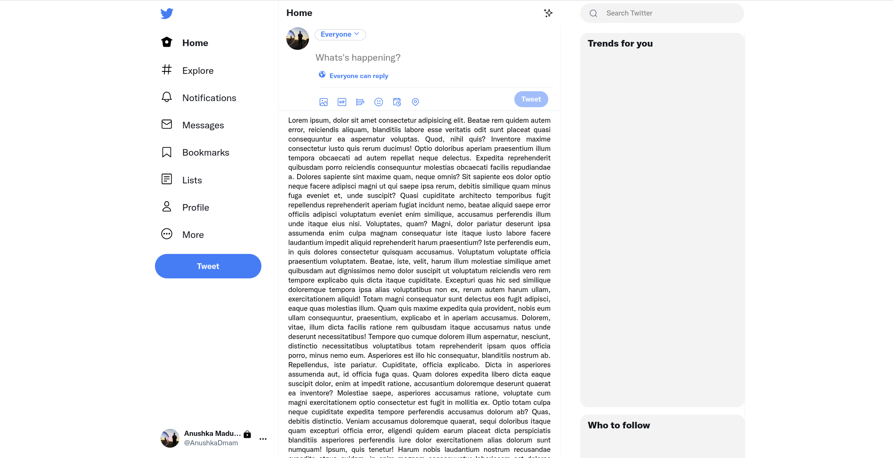
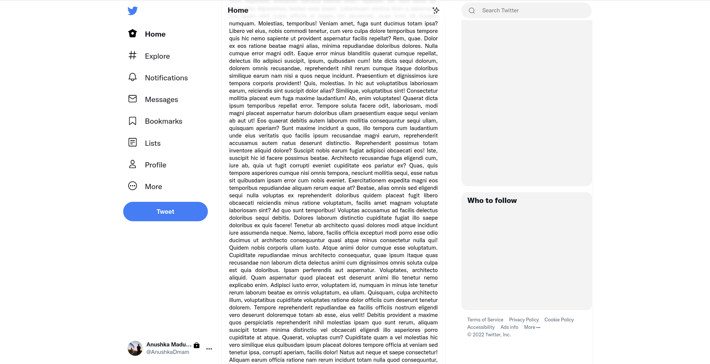
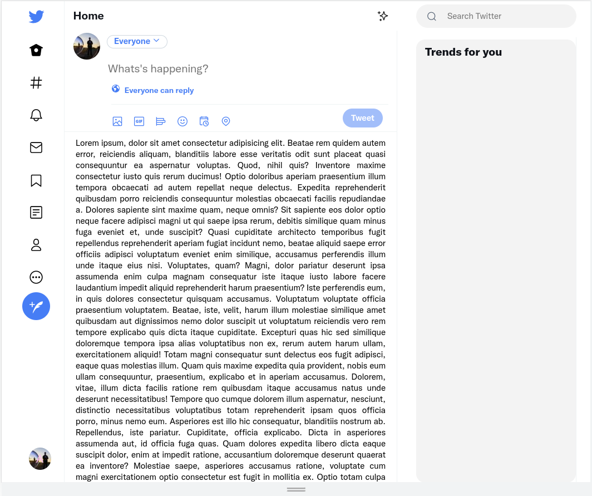
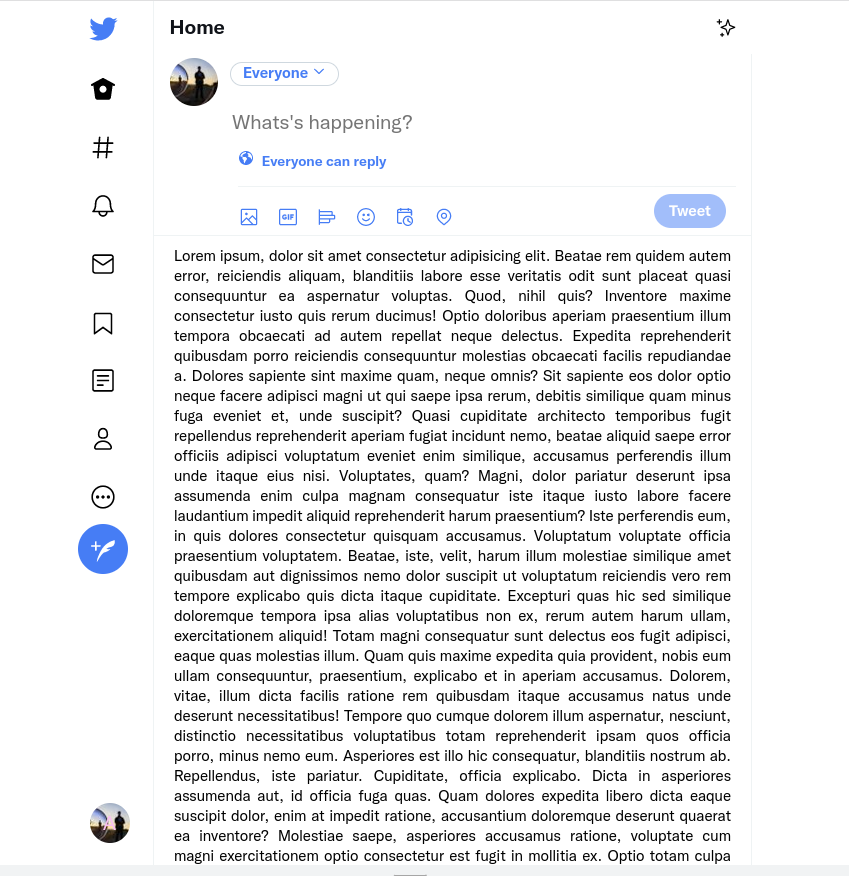

# About The Project

This pure HTML and CSS project is a clone website of the twitter. The clone website has been designed as completely responsive web design with pure HTML and CSS to practice and improve my web design skills. The whole design layout and images are copyrighted to their respective owners. It is not complete yet.
To visit twitter-clone [click here.](https://anushkadissanayake.github.io/twitter-clone/)


## Screenshots










## Built With

- [HTML5 ](https://developer.mozilla.org/en-US/docs/Glossary/HTML5)
- [CSS3 ](https://developer.mozilla.org/en-US/docs/Web/CSS)
    - Animations
    - Transitions
    - Transformations
    - Media Query
    - Flex Layout


## How to Use This Repository

Anyone who want to clone project using following command or [direct downlod](https://github.com/AnushkaDissanayake/twitter-clone/archive/refs/heads/main.zip) zip file.

```bash
  git clone https://github.com/AnushkaDissanayake/twitter-clone.git
```
    
## License

[MIT]()


## 🚀 About Me
I'm a full stack developer...


## 🔗 Links
[](https://www.linkedin.com/in/anushka-madusanka-disanayaka-294660170/)

